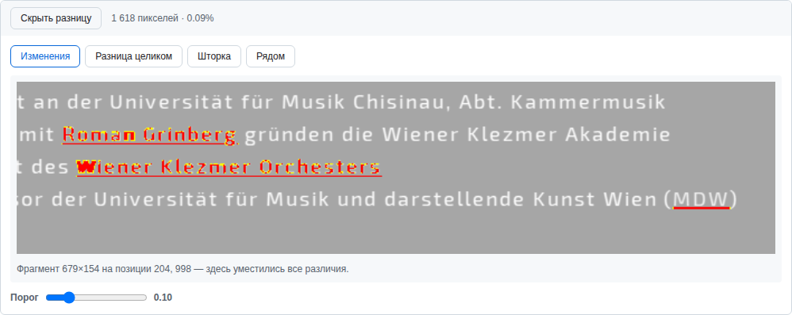
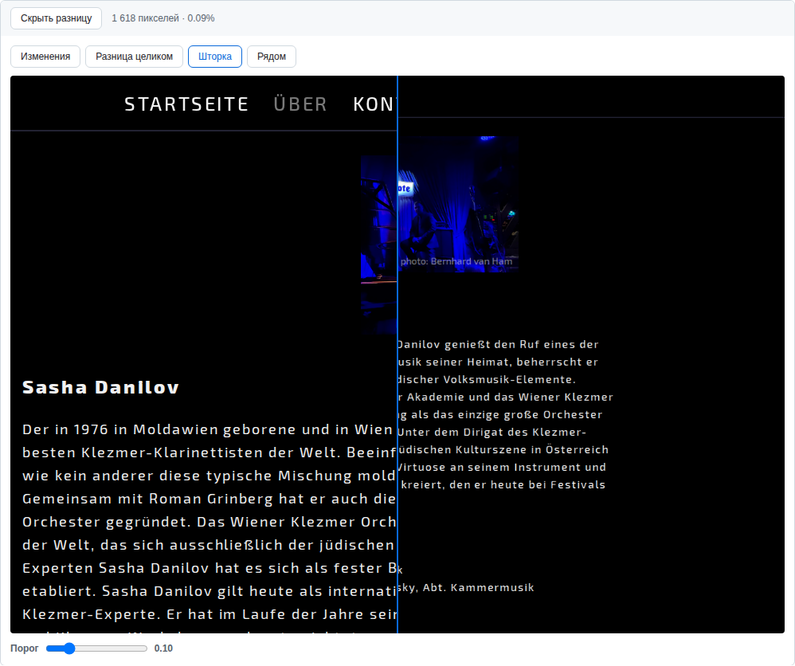
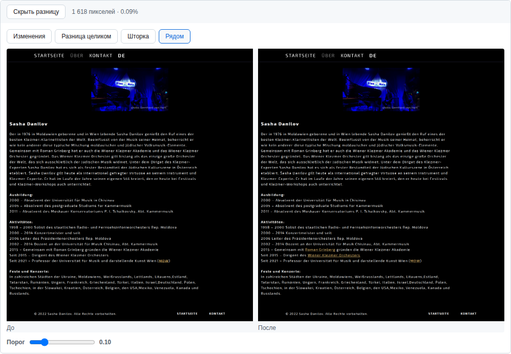

# GitHub Pixel Diff

Расширение показывает попиксельную разницу изображений прямо в diff'е пул-реквеста
на GitHub — тем же красным по серому, каким её рисуют скриншотные тесты.

GitHub умеет показывать две версии картинки рядом, шторкой и наложением, но не
умеет главного: сказать, **что именно** изменилось. На снимке страницы высотой
в три тысячи пикселей правка занимает четыре строки — и найти их глазами нельзя.
Расширение считает разницу и по умолчанию открывает сразу тот фрагмент, где она
уместилась.



## Что умеет

- **Изменения** — фрагмент, обрезанный по области различий, с полем вокруг.
- **Разница целиком** — весь кадр с подсветкой.
- **Шторка** — до и после под подвижной границей.
- **Рядом** — обе версии бок о бок.
- Счётчик: сколько пикселей изменилось и какую долю кадра это составляет.
- Порог чувствительности — от «ловить сглаживание» до «только заметное глазу».
- Разные размеры «до» и «после» не ломают сравнение: кадры выравниваются по
  левому верхнему углу, а изменение размера показывается в строке состояния.

| Шторка | Рядом |
|---|---|
|  |  |

## Установка

Готовых сборок в магазинах пока нет — ставится из исходников.

```bash
npm run build     # собирает dist/chrome, dist/firefox, dist/safari
```

**Chrome, Edge, любой Chromium** — `chrome://extensions` → включить «Режим
разработчика» → «Загрузить распакованное расширение» → папка `dist/chrome`.

**Firefox** — `about:debugging#/runtime/this-firefox` → «Загрузить временное
дополнение» → файл `dist/firefox/manifest.json`. Временное дополнение живёт до
перезапуска браузера; для постоянной установки расширение нужно подписать на
addons.mozilla.org.

**Safari, macOS** — `npm run build:safari` (нужен Xcode; при первом запуске
конвертер может потребовать `sudo xcodebuild -runFirstLaunch`). Дальше открыть
полученный проект, собрать схему «GitHub Pixel Diff (macOS)» и запустить
приложение-контейнер. Затем в Safari: Настройки → Дополнения → включить
расширение. Для неподписанной сборки предварительно нужно разрешить такие
расширения в меню Разработка.

**Safari, iPhone и iPad** — тот же проект, схема с суффиксом `(iOS)`, сборка на
своё устройство из Xcode. Понадобится установленная платформа iOS
(Xcode → Настройки → Компоненты, либо `xcodebuild -downloadPlatform iOS`). Дальше Настройки → Приложения → Safari → Расширения.
Бесплатный аккаунт разработчика даёт сертификат на семь дней, после чего проект
нужно пересобрать; постоянная установка — только через App Store.

**Chrome на Android** расширения не поддерживает — ни это, ни любое другое.
На Android остаётся Firefox, но временные дополнения там недоступны: нужна
подписанная сборка.

### Что проверено

| Цель | Состояние |
|---|---|
| Chrome / Chromium | Проверено на живой странице пул-реквеста, тест в наборе |
| Firefox | Сборка проходит проверку `web-ext lint` без замечаний; в браузере не гонялась |
| Safari, macOS | Схема компилируется; включение расширения в браузере — вручную |
| Safari, iOS | Схема компилируется, контейнер ставится и запускается в симуляторе (`npm run run:ios`); включение — вручную |

Сама панель во всех трёх браузерах — один и тот же content script, поэтому
проверка в Chromium покрывает и логику сравнения, и вёрстку. Неизвестной
остаётся ровно установка: она у каждого браузера своя.

## Как это устроено

Сами картинки GitHub рендерит в iframe с чужого домена
(`viewscreen.githubusercontent.com`), куда расширению не заглянуть. Но адреса
обеих версий лежат прямо в адресе этого iframe — шестнадцатеричной строкой в
параметрах `enc_url1` и `enc_url2`. Расширение читает их, загружает картинки с
`raw.githubusercontent.com` (он отдаёт `access-control-allow-origin: *`,
поэтому холст остаётся читаемым) и сравнивает через
[pixelmatch](https://github.com/mapbox/pixelmatch).

Отсюда три следствия:

- Фонового процесса нет вовсе — только content script. Поэтому манифест почти
  не отличается между тремя браузерами: Firefox добавляет свой идентификатор,
  Safari берёт сборку как есть.
- Никаких запросов к API GitHub и никаких токенов. Расширение не читает и не
  отправляет ничего, кроме тех двух картинок, что вы попросили сравнить.
- Разметку diff-вью GitHub меняет без предупреждений. Поэтому в тестах есть
  проверка на живой странице — она и сломается первой, если формат уедет.

## Разработка

```bash
npm run build     # сборка всех трёх целей
npm test          # тесты в образе Playwright (нужен Docker)
```

Тесты — два уровня. `tests/parse.spec.js` проверяет разбор адресов и поиск
области различий, не выходя в сеть. `tests/live.spec.js` поднимает настоящий
Chromium с загруженным расширением, открывает публичный пул-реквест и
убеждается, что панель встала на место и посчитала разницу.

Прогон идёт в контейнере, чтобы результат не зависел от того, что стоит на
машине.

## Лицензия

MIT — см. [LICENSE](LICENSE). В составе — [pixelmatch](src/vendor/pixelmatch.js)
под лицензией ISC, © Mapbox.
