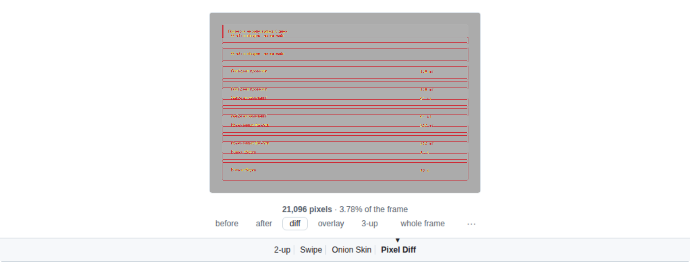
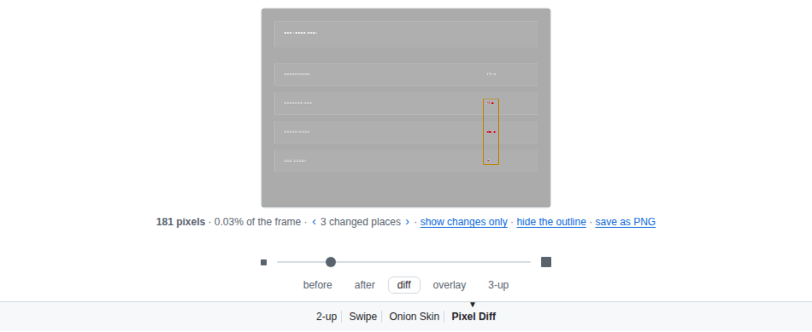
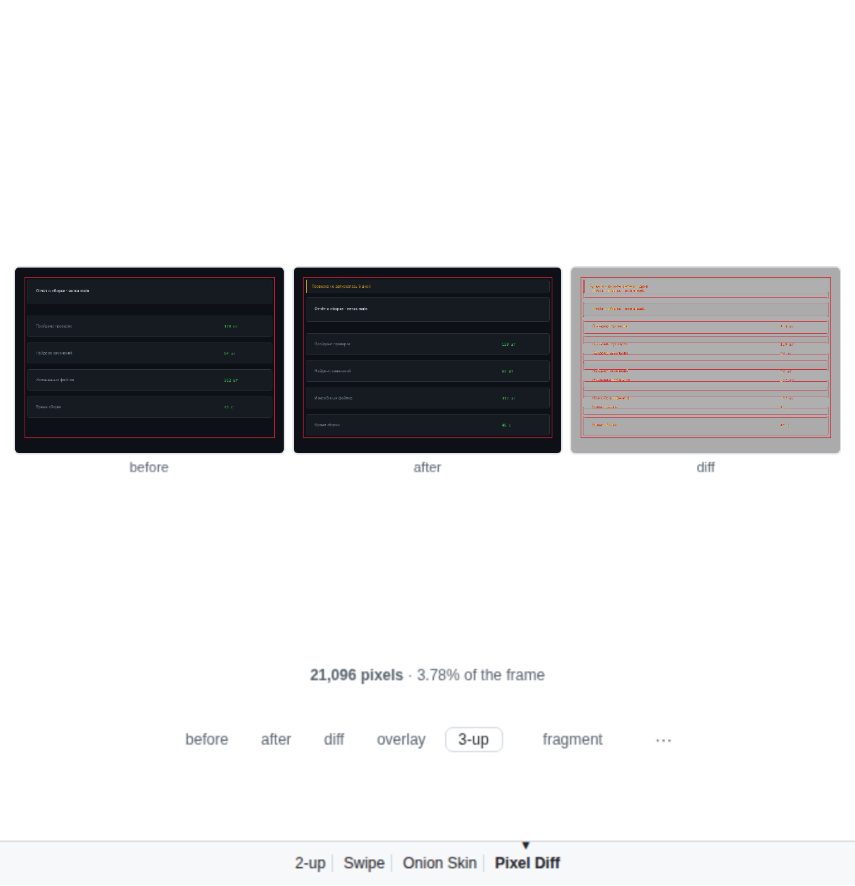
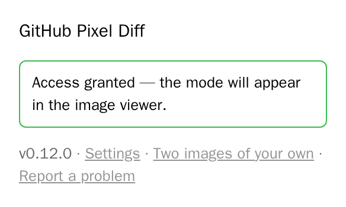

# GitHub Pixel Diff

[Русский](README.ru.md) · **English**

GitHub can show two versions of an image side by side, behind a swipe handle and
as an overlay — but not the one thing that matters: **what actually changed**. On
a three-thousand-pixel page screenshot an edit takes up four lines, and no eye
will find them.

The extension adds a fourth mode next to **2-up**, **Swipe** and **Onion Skin** —
**Pixel Diff**: it compares the images pixel by pixel and opens straight on the
fragment where the difference lives.



**No pull request at hand?** The same comparison works on two files of your own:
<https://nemo-illusionist.github.io/gh-pixel-diff/> — drop two images and get the
same diff. Nothing is uploaded: the page is a static file, and the comparison
runs in your browser.

## What it does

- Sits as a fourth button in the native row of modes — no separate panel.
- Opens on the changed fragment; the full frame is one link away in the caption,
  with the changed area outlined in red — the outline can be turned off, and the
  choice is remembered.
- Counts how many pixels changed and what share of the frame that is.
- A threshold slider — from "catch even anti-aliasing" to "only what the eye
  sees" — styled like the Onion Skin one.
- A before / after / diff / **3-up** switcher under the frame: any one version,
  or all three side by side — always in the same scale and the same crop as the
  difference, which the native 2-up and Swipe cannot do. The choice is
  remembered, and the switcher can be turned off in the extension's window.
- Different "before" and "after" sizes don't break the comparison: frames are
  aligned by their top-left corner and the resize is reported in the caption.
- Works in private repositories: the image addresses are read from the frame
  GitHub has already built — signed URLs and all — rather than reconstructed
  from the repository name.
- If the pull request came from a fork that was later deleted, the image is
  taken from the upstream repository — GitHub itself shows "Invalid image
  source" in that case.
- Once you pick Pixel Diff, the next image in the pull request opens in it too —
  no clicking through twenty files.
- SVG is rasterized at a sensible size instead of the 300×150 a browser makes up
  for a vector with no intrinsic size; the caption says what size was compared.
- The comparison runs in a worker, so the panel stays alive on multi-megapixel
  screenshots — and the images live there, not in the frame's own memory.
- The interface speaks English, or Russian when the browser is set to Russian.





## Installation

Prebuilt archives live on the
[releases page](https://github.com/Nemo-Illusionist/gh-pixel-diff/releases).
GitHub builds them from this very repository; SHA-256 sums sit next to them in
`checksums.txt`. To build from source run `npm run build` and follow the same
steps, using the `dist/` folder instead of an unpacked archive.

### Chrome, Edge, any Chromium

1. Download and unpack `gh-pixel-diff-chrome-*.zip`.
2. Open `chrome://extensions` and turn on "Developer mode".
3. "Load unpacked" → the unpacked folder.

### Firefox

1. Download `gh-pixel-diff-firefox-*.zip` (no need to unpack it).
2. Open `about:debugging#/runtime/this-firefox`.
3. "Load Temporary Add-on" → pick the archive.

A temporary add-on lives until the browser restarts. A permanent install
requires the extension to be signed on addons.mozilla.org.

### Safari, macOS

Safari doesn't install extensions from a folder: it needs an Xcode project, a
container app and a signature. Without a certificate macOS simply won't register
the extension and it will never appear in Safari's list — a free Apple ID added
to Xcode (Settings → Accounts) is enough for that.

1. Download and unpack `gh-pixel-diff-safari-*.zip`, then follow
   `SAFARI-INSTALL.txt` inside. From source the same thing is done by
   `npm run build:safari` (on first run the converter may ask for
   `sudo xcodebuild -runFirstLaunch`).
2. Open the resulting project and pick your development team in the target
   settings.
3. Build the "GitHub Pixel Diff (macOS)" scheme and run the container app.
4. Safari → Settings → Extensions → enable the extension.
5. Click the extension button in Safari's toolbar and choose "Grant access".

From source all of that is done by `npm run install:macos`: it builds, signs
with the first development certificate it finds, installs the app into
`/Applications` and unregisters the temporary copy from the build folder —
otherwise Safari lists the extension twice.

That last step is not a formality. Safari does not extend a site permission to
cross-origin frames, and the images live exactly in such a frame — so access is
needed to `viewscreen.githubusercontent.com`, a domain nobody ever types into
the address bar.

### Safari, iPhone and iPad

The same project, the scheme with the `(iOS)` suffix, built onto your own device
from Xcode — there is no other way: extensions reach mobile Safari either like
this or through the App Store.

1. Install the iOS platform (Xcode → Settings → Components, or
   `xcodebuild -downloadPlatform iOS`).
2. Pick the "GitHub Pixel Diff (iOS)" scheme and your device, then build.
3. Settings → Apps → Safari → Extensions → enable it.

A free developer account issues a certificate valid for seven days, after which
the project has to be rebuilt. A permanent install goes through the App Store
only, and that needs a paid Apple Developer Program membership.

### Android

Chrome on Android supports no extensions at all — neither this one nor any
other. Firefox remains, but temporary add-ons are unavailable there: a signed
build is required.

## Granting access

However it was installed, the extension needs access to one domain —
`viewscreen.githubusercontent.com`. Chrome and Firefox grant it on install;
Safari does not, because a site permission there does not extend to
cross-origin frames, and the images live exactly in such a frame.

Access is requested from the extension's own window: click its button in the
toolbar and press **Grant access**. The same window shows whether access is
already there.



The same window opens from Safari's settings: Settings → Extensions → GitHub
Pixel Diff → **Settings**. Next to it sits Safari's own **Edit websites…**
button, which grants access without any window: set
`viewscreen.githubusercontent.com` to "Allow".

Nothing else is requested. There are no permissions for `github.com` pages at
all, so the extension cannot see your repositories or your session. Nothing is
collected and nothing is sent anywhere — see the
[privacy policy](docs/PRIVACY.md).

## What has been verified

| Target | State |
|---|---|
| Chrome / Chromium | Verified on a live pull request page, covered by a test |
| Firefox | The build passes `web-ext lint` with no warnings; never run in the browser |
| Safari, macOS | The scheme compiles; enabling the extension is manual |
| Safari, iOS | The scheme compiles, the container installs and launches in the simulator (`npm run run:ios`); enabling is manual |

The panel itself is the same content script in all three browsers, so testing in
Chromium covers both the comparison logic and the layout. What stays unknown is
exactly the installation — it differs per browser.

## How it works

GitHub renders binary file previews in a separate frame on its own domain —
`viewscreen.githubusercontent.com`. Both versions of the image and the mode
switcher live there too, so the extension works inside that frame and by its
rules: its own radio button in `.js-view-modes`, its own container, its own
slider. Image addresses come from the `enc_url1` and `enc_url2` parameters of the
frame URL, are loaded from `raw.githubusercontent.com` (which serves
`access-control-allow-origin: *`, keeping the canvas readable) and compared with
[pixelmatch](https://github.com/mapbox/pixelmatch).

Three consequences follow:

- **The extension never sees github.com pages at all.** Its permissions cover
  only `viewscreen.githubusercontent.com`, where neither your repositories nor
  your session exist.
- There is no background process — only a content script and a worker it builds
  itself. An extension cannot start a worker from its own address inside someone
  else's page, so the sources are read with `fetch` and glued into a blob; if
  that fails, the comparison falls back to the main thread. That's why the
  manifest barely differs between the three browsers: Firefox adds its own
  identifier, Safari takes the build as is.
- GitHub changes the viewer markup without warning. Hence the live page test —
  it will be the first thing to break if the format moves.

## Development

```bash
npm run build     # builds all three targets
npm run build:site   # the standalone page into dist/site
npm test          # tests in the Playwright image (needs Docker)
npm run package   # release archives into dist/release
npm run screenshots  # README and store screenshots, from the live pull request
```

On every push and pull request GitHub runs the offline tests in that same
Playwright image and checks the Firefox build with `web-ext lint`. The live test
is a separate run — weekly and on demand: it breaks because of someone else's
changes, not ours, and shouldn't block a pull request.

`main` is protected: no direct pushes, including from the owner. Everything
lands through a pull request with both checks green, and history stays linear
(squash merges only).

A release therefore comes in two steps. `npm run release -- 0.6.0` opens a pull
request that bumps the version in `package.json` and the manifest; once it is
merged, tagging `v0.6.0` on `main` builds the archives, checks the tag against
the manifest version and publishes them to the releases page. The same tag then
pushes the build to the Chrome Web Store and to addons.mozilla.org — each store
is switched on by a repository variable, so a fork never tries to publish in
someone else's name. Setting that up is described in
[docs/PUBLISHING.md](docs/PUBLISHING.md).

Tests come in four levels. `tests/parse.spec.js` checks URL parsing, the
repository fallback and the search for the changed area, without touching the
DOM. `tests/frame.spec.js` loads the extension into a stub of GitHub's viewer
frame and checks how it coexists with someone else's markup: that exactly one
mode is visible at a time, that the panel doesn't change the document height,
that the content stays centered in a tall frame. Every one of those broke at
least once and was caught by eye on a screenshot. `tests/live.spec.js` starts a
real Chromium with the extension loaded, opens the
[test-bed pull request](https://github.com/Nemo-Illusionist/gh-pixel-diff/pull/1)
and makes sure the mode joined the native row and counted the difference.
`tests/locales.spec.js` and `tests/popup.spec.js` stay out of the browser
entirely: the first checks that every string the code asks for exists in every
locale, the second that markup inside a translated string is parsed into nodes
rather than swallowed.

The test bed is an open pull request with a single changed image in this same
repository; it is deliberately never merged. The test used to point at someone
else's pull request, and that stopped working when the fork holding the original
image was deleted.

The run happens in a container so that the result doesn't depend on what is
installed on the machine.

The standalone page in `site/` is a shell around the same code, not a second
copy of it: `scripts/build-site.mjs` takes the comparison, the drawing, the
worker and the panel's styles straight out of `src/`, and the page's own strings
live in the same locale files. It is deployed to GitHub Pages by
`.github/workflows/pages.yml` on every push to `main` that touches it.

Interface strings live in `src/_locales`. English is the fallback locale; a new
language is a copy of `en/messages.json` with the values translated — Russian
carries two extra plural forms, which `Intl.PluralRules` picks by itself.

## License

MIT — see [LICENSE](LICENSE). Bundled:
[pixelmatch](src/vendor/pixelmatch.js) under the ISC license, © Mapbox.
