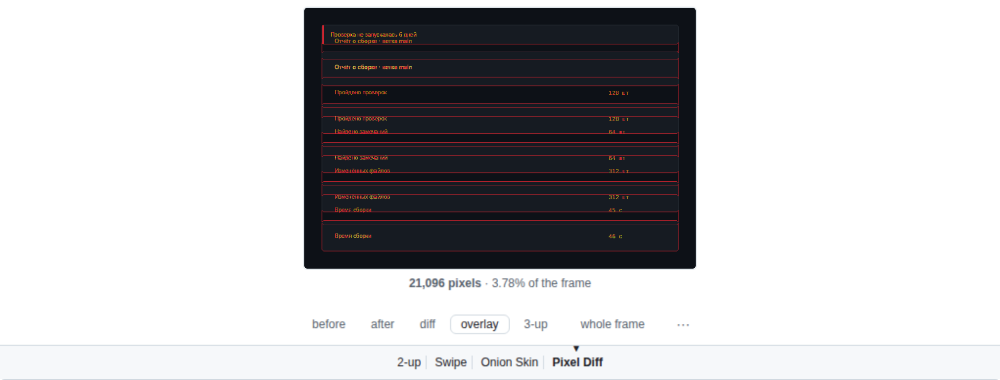
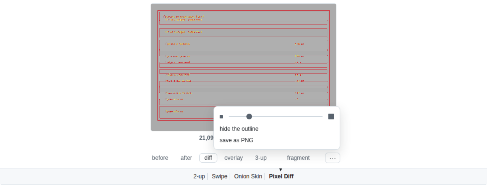
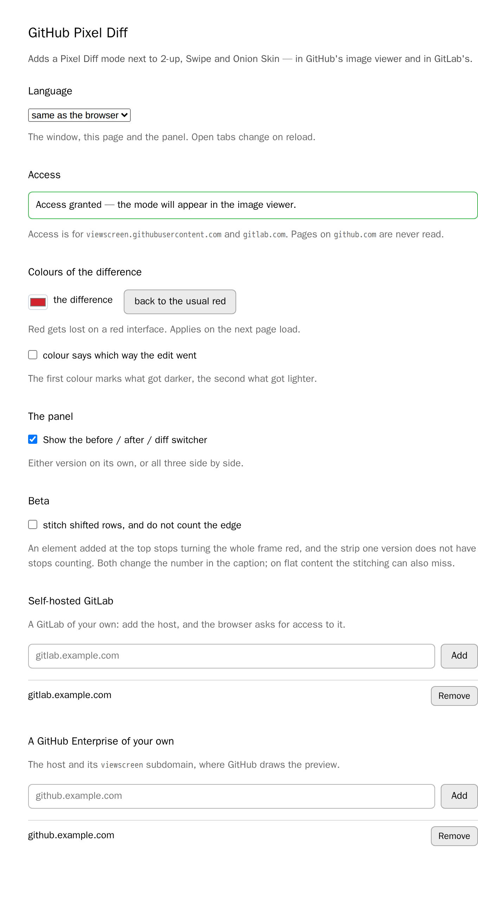

# GitHub Pixel Diff

[Русский](README.ru.md) · **English**

[][store]
[][amo]
[](#safari-macos)
[][site]

GitHub and GitLab can both show two versions of an image side by side, behind a
swipe handle and as an overlay — but not the one thing that matters: **what
actually changed**. On a three-thousand-pixel page screenshot an edit takes up
four lines, and no eye will find them.

The extension adds a fourth mode next to **2-up**, **Swipe** and **Onion Skin** —
**Pixel Diff**: it compares the images pixel by pixel and opens straight on the
fragment where the difference lives. It works in GitHub's image viewer and in
GitLab's, in merge requests on `gitlab.com`.


**No pull request at hand?** The same comparison works on two files of your own:
<https://nemo-illusionist.github.io/gh-pixel-diff/> — drop two images and get the
same diff. Nothing is uploaded: the page is a static file, and the comparison
runs in your browser.

## What it does

- Sits as a fourth button in the native row of modes — no separate panel.
- Opens on the changed fragment; the full frame is one link away in the caption,
  with the changed area outlined in the same colour as the difference — the
  outline can be turned off, and the choice is remembered.
- **Changes in different corners are separate places, and you can walk between
  them**: the caption says `‹ 3 changed places ›`, and stepping crops to one
  place at a time, in reading order. By default all of them are shown at once,
  the way they always were — a single fragment holding two distant edits is the
  whole frame again. While a place is chosen, every place is outlined and the
  current one is brighter.
- Counts how many pixels changed and what share of the frame that is.
- Pixels that differ but look like anti-aliasing are marked in yellow, at half
  strength, and are not counted as changes — a half-pixel shift is worth seeing
  without turning the whole frame red.
- A threshold slider — from "catch even anti-aliasing" to "only what the eye
  sees" — styled like the Onion Skin one.
- The difference is painted in one colour, and **the colour can be changed** on
  the settings page — red gets lost on a red interface. Turn on *colour says
  which way the edit went* there and the frame gets a second one: the first
  marks what got darker — text or an element appeared — and the second what got
  lighter.
- **Zoom and pan**: Ctrl + scroll (or a trackpad pinch) magnifies the frame,
  dragging moves it, a double click jumps in and back, and the keyboard does the
  same with `+`, `-`, `0` and the arrows. Magnified pixels stay square rather
  than blurred — a one-pixel shift is a thing you can actually look at. Plain
  scrolling still belongs to the page.
- A before / after / diff / **overlay** / **3-up** switcher under the frame:
  any one version, all three side by side, or the difference painted straight
  onto the new version in full colour — always in the same scale and the same
  crop, which the native 2-up and Swipe cannot do. The choice is remembered,
  and the switcher can be turned off on the settings page.
- **A pixel inspector**: point at the frame and the line under it says which
  pixel that is and what colour it was before and after — swatches and hex
  codes. "Is that really the same grey?" no longer needs an eyedropper in
  another app.
- **Save what you see as a PNG**: the chosen frame, the crop, the zoom, the
  outlines — whatever is on screen goes into `shot.diff.png`, ready to drop into
  a comment or a ticket.
- **Beta: stitching shifted rows, and the edge one version doesn't have.** An
  element added at the top pushes everything below it down, and the comparison
  then reports the whole frame as changed; a frame that got two dozen rows
  shorter grows a solid red band at the bottom that the real edit drowns in.
  Turn *stitch shifted rows, and do not count the edge* on in the settings and
  rows are matched to their counterparts first — by the same trick text diffs
  use to tell an edited line from an inserted one — while the band is marked at
  half strength and counts neither towards the number nor towards the crop. It
  is off by default: both change the number in the caption, and the stitching is
  a guess besides — on flat content, an empty list or plain margins, rows are
  indistinguishable and can be stitched any which way, and then the frame gets
  marks where nothing changed.
- Different "before" and "after" sizes don't break the comparison: frames are
  aligned by their top-left corner and the resize is reported in the caption.
- Works in private repositories: the image addresses are read from the frame
  GitHub has already built — signed URLs and all — rather than reconstructed
  from the repository name.
- If the pull request came from a fork that was later deleted, the image is
  taken from the upstream repository — GitHub itself shows "Invalid image
  source" in that case.
- Once you pick Pixel Diff, the next image in the pull request opens in it too —
  no clicking through twenty files.
- SVG is rasterized at a sensible size instead of the 300×150 a browser makes up
  for a vector with no intrinsic size; the caption says what size was compared.
- The comparison runs in a worker, so the panel stays alive on multi-megapixel
  screenshots — and the images live there, not in the frame's own memory.
- The interface speaks English, or Russian when the browser is set to Russian.


The overlay puts the difference straight onto the new version, in full colour:



Under the frame there are only two answers and the hands that go with them: a
line of facts (how much changed, and what it was measured on) and a line of
controls (which frame to show, and where in it to look). The threshold, the
outline and saving live under «⋯» — they aren't needed every time, yet they
took up room always.



## Installation

**Chrome, Edge, any Chromium** — [in the Chrome Web Store][store]. One button,
and updates arrive on their own.

Everything below is for the other browsers, and for anyone who would rather
install a build of their own. Prebuilt archives live on the
[releases page](https://github.com/Nemo-Illusionist/gh-pixel-diff/releases).
GitHub builds them from this very repository; SHA-256 sums sit next to them in
`checksums.txt`. To build from source run `npm run build` and follow the same
steps, using the `dist/` folder instead of an unpacked archive.

### Chrome, Edge, any Chromium — from an archive

1. Download and unpack `gh-pixel-diff-chrome-*.zip`.
2. Open `chrome://extensions` and turn on "Developer mode".
3. "Load unpacked" → the unpacked folder.

### Firefox

The add-on is on [addons.mozilla.org][amo] — signed, and it updates itself.

To try a build of your own instead:

1. Download `gh-pixel-diff-firefox-*.zip` (no need to unpack it).
2. Open `about:debugging#/runtime/this-firefox`.
3. "Load Temporary Add-on" → pick the archive.

Such an add-on lives until the browser restarts: unsigned, Firefox installs it
no other way.

### Safari, macOS

Safari doesn't install extensions from a folder: it needs an Xcode project, a
container app and a signature. Without a certificate macOS simply won't register
the extension and it will never appear in Safari's list — a free Apple ID added
to Xcode (Settings → Accounts) is enough for that.

1. Download and unpack `gh-pixel-diff-safari-*.zip`, then follow
   `SAFARI-INSTALL.txt` inside. From source the same thing is done by
   `npm run build:safari` (on first run the converter may ask for
   `sudo xcodebuild -runFirstLaunch`).
2. Open the resulting project and pick your development team in the target
   settings.
3. Build the "GitHub Pixel Diff (macOS)" scheme and run the container app.
4. Safari → Settings → Extensions → enable the extension.
5. Click the extension button in Safari's toolbar and choose "Grant access".

From source all of that is done by `npm run install:macos`: it builds, signs
with the first development certificate it finds, installs the app into
`/Applications` and unregisters the temporary copy from the build folder —
otherwise Safari lists the extension twice.

That last step is not a formality. Safari does not extend a site permission to
cross-origin frames, and the images live exactly in such a frame — so access is
needed to `viewscreen.githubusercontent.com`, a domain nobody ever types into
the address bar.

### Safari, iPhone and iPad

The same project, the scheme with the `(iOS)` suffix, built onto your own device
from Xcode — there is no other way: extensions reach mobile Safari either like
this or through the App Store.

1. Install the iOS platform (Xcode → Settings → Components, or
   `xcodebuild -downloadPlatform iOS`).
2. Pick the "GitHub Pixel Diff (iOS)" scheme and your device, then build.
3. Settings → Apps → Safari → Extensions → enable it.

A free developer account issues a certificate valid for seven days, after which
the project has to be rebuilt. A permanent install goes through the App Store
only, and that needs a paid Apple Developer Program membership.

### Android

Chrome on Android supports no extensions at all — neither this one nor any
other. Firefox remains, but temporary add-ons are unavailable there: a signed
build is required.

## Granting access

However it was installed, the extension needs access to two domains —
`viewscreen.githubusercontent.com`, the frame GitHub renders image diffs in, and
`gitlab.com`, where GitLab renders them on the page itself. Chrome and Firefox
grant them on install;
Safari does not, because a site permission there does not extend to
cross-origin frames, and the images live exactly in such a frame.

Access is requested from the extension's own window: click its button in the
toolbar and press **Grant access**. The window is only that — the state of the
access and a row of links; everything else lives on the settings page.




The settings page opens from the same window, by the **Settings** link — and in
Safari from Settings → Extensions → GitHub Pixel Diff → **Settings**. Next to it
sits Safari's own **Edit websites…** button, which grants access without any
window: set `viewscreen.githubusercontent.com` to "Allow".

Nothing else is requested up front. There are no permissions for `github.com`
pages at all, so the extension cannot see your repositories or your session.
Nothing is collected and nothing is sent anywhere — see the
[privacy policy](docs/PRIVACY.md).

### The language of the interface

Normally the extension speaks whatever language the browser is set to. A browser
in English and work in Russian live in the same head all the time, though, and
the browser has no per-extension language switch — so the settings page has one:
**Language** → same as the browser, English, Русский. It covers the window, the
settings page itself and the comparison panel; pages already open keep the old
language until they are reloaded.

The panel lives inside someone else's page and cannot reach the extension's own
locale files, so the settings page hands the strings over through storage. The
standalone site still follows the browser.

### A GitHub Enterprise of your own

A self-hosted GitHub is added the same way, in its own section: type the
instance — `github.example.com` — and press **Add**. The browser asks for
access to that host and to its `viewscreen` subdomain, where GitHub draws the
preview: with subdomain isolation on it lives there, without it on the host
itself, and which of the two it is cannot be known in advance.

The mode is the same one github.com gets — the frame, its markup and the
encoded image addresses are identical, so nothing else had to be taught. The
host is not checked at all; what identifies the viewer is the path and the
parameters. Reload the tab if the instance is already open.

### A GitLab of your own

Self-hosted GitLab lives at an address no manifest can know in advance, so it
cannot be asked for at install time. Instead it is added by hand, on the
settings page: type the host — `gitlab.example.com` — and press **Add**. The
browser asks whether to grant access to that one address; once it is granted,
the extension registers its content script for the instance and the mode appears
in its image viewer. Reload the tab if the instance is already open.

The list on that page shows what has been granted, and **Remove** takes both the
permission and the registration back. The list is not ours to keep: it is read
from the browser every time the page opens, so a permission revoked in the
browser's own settings disappears from it too.

On a page that is not GitLab the extension does nothing at all, whatever address
was granted: it looks for GitLab's own `data-page` marker before touching the
markup.

## What has been verified

| Target | State |
|---|---|
| Chrome / Chromium | Verified on a live pull request page, covered by a test |
| Firefox | The build passes `web-ext lint` with no warnings; never run in the browser |
| Safari, macOS | The scheme compiles; enabling the extension is manual |
| Safari, iOS | The scheme compiles, the container installs and launches in the simulator (`npm run run:ios`); enabling is manual |

The panel itself is the same content script in all three browsers, so testing in
Chromium covers both the comparison logic and the layout. What stays unknown is
exactly the installation — it differs per browser.

## How it works

GitHub renders binary file previews in a separate frame on its own domain —
`viewscreen.githubusercontent.com`. Both versions of the image and the mode
switcher live there too, so the extension works inside that frame and by its
rules: its own radio button in `.js-view-modes`, its own container, its own
slider. Image addresses come from the `enc_url1` and `enc_url2` parameters of the
frame URL, are loaded from `raw.githubusercontent.com` (which serves
`access-control-allow-origin: *`, keeping the canvas readable) and compared with
[pixelmatch](https://github.com/mapbox/pixelmatch).

Three consequences follow:

- **The extension never sees github.com pages at all.** Its permissions cover
  only `viewscreen.githubusercontent.com`, where neither your repositories nor
  your session exist.
- There is no background process — only a content script and a worker it builds
  itself. An extension cannot start a worker from its own address inside someone
  else's page, so the sources are read with `fetch` and glued into a blob; if
  that fails, the comparison falls back to the main thread. That's why the
  manifest barely differs between the three browsers: Firefox adds its own
  identifier, Safari takes the build as is.
- GitHub changes the viewer markup without warning. Hence the live page test —
  it will be the first thing to break if the format moves.

## Development

```bash
npm run build     # builds all three targets
npm run build:site   # the standalone page into dist/site
npm test          # tests in the Playwright image (needs Docker)
npm run package   # release archives into dist/release
npm run screenshots  # README and store screenshots, from the live pull request
```

On every push and pull request GitHub runs the offline tests in that same
Playwright image and checks the Firefox build with `web-ext lint`. The live test
is a separate run — weekly and on demand: it breaks because of someone else's
changes, not ours, and shouldn't block a pull request.

`main` is protected: no direct pushes, including from the owner. Everything
lands through a pull request with both checks green, and history stays linear
(squash merges only).

Releases run themselves, from the commit subjects. Those follow
[conventional commits](https://www.conventionalcommits.org/) — `feat:`, `fix:`,
`docs:`, `refactor:`, `ci:`, `chore:` — in English, since they end up in the
changelog and in the release notes, which are read by the same people the README
is written for. The body of the commit is free-form.

Prefixes, and what each one does:

| Prefix | Version | Changelog |
| --- | --- | --- |
| `feat:` | minor | **Features** |
| `fix:` | patch | **Bug Fixes** |
| `perf:` | patch | **Performance** |
| `docs:` | patch | **Documentation** |
| `refactor:` | patch | **Refactors** |
| `chore:` `ci:` `build:` `test:` `style:` | patch | hidden |
| any of them with `!` | **major** | highlighted |

Pick by what the change does for whoever uses the extension, not by how it felt
to write: a one-line change that fixes broken behaviour is `fix:`, a large
refactor nobody can observe is `refactor:`. Nothing validates the prefix — a
wrong one is silent, and by the time it is merged the version and the changelog
line are already made from it.

The repository squash-merges, and the pull request title becomes that single
commit. So the title is not a summary dashed off before merging; it is the
release note.

release-please reads them, works out the next version and keeps a pull request
open with it: the version bumped in `package.json` and the manifest, the
changelog written. Merging that pull request creates the tag and the release;
the same workflow run then builds the archives, attaches them, and pushes the
build to the Chrome Web Store and to addons.mozilla.org. Each store is switched
on by a repository variable, so a fork never tries to publish in someone else's
name — see [docs/PUBLISHING.md](docs/PUBLISHING.md).

It has to happen in one run: events created by `GITHUB_TOKEN` do not start other
workflows, so nothing here can wait for a tag to appear.

The same rule costs one manual step. The release pull request is opened by
`GITHUB_TOKEN`, so its checks never start on their own — and `main` requires
them. Press **Close** on that pull request and then **Reopen**: the event now
comes from a person, the checks run, and it merges like any other.

Tests come in four levels. `tests/parse.spec.js` checks URL parsing, the
repository fallback and the search for the changed area, without touching the
DOM. `tests/frame.spec.js` loads the extension into a stub of GitHub's viewer
frame and checks how it coexists with someone else's markup: that exactly one
mode is visible at a time, that the panel doesn't change the document height,
that the content stays centered in a tall frame. Every one of those broke at
least once and was caught by eye on a screenshot. `tests/live.spec.js` starts a
real Chromium with the extension loaded, opens the
[test-bed pull request](https://github.com/Nemo-Illusionist/gh-pixel-diff/pull/1)
and makes sure the mode joined the native row and counted the difference.
`tests/locales.spec.js` and `tests/popup.spec.js` stay out of the browser
entirely: the first checks that every string the code asks for exists in every
locale, the second that markup inside a translated string is parsed into nodes
rather than swallowed.

The test bed is an open pull request with a single changed image in this same
repository; it is deliberately never merged. The test used to point at someone
else's pull request, and that stopped working when the fork holding the original
image was deleted.

The run happens in a container so that the result doesn't depend on what is
installed on the machine.

The standalone page in `site/` is a shell around the same code, not a second
copy of it: `scripts/build-site.mjs` takes the comparison, the drawing, the
worker and the panel's styles straight out of `src/`, and the page's own strings
live in the same locale files. It is deployed to GitHub Pages by
`.github/workflows/pages.yml` on every push to `main` that touches it.

Interface strings live in `src/_locales`. English is the fallback locale; a new
language is a copy of `en/messages.json` with the values translated — Russian
carries two extra plural forms, which `Intl.PluralRules` picks by itself.

## License

MIT — see [LICENSE](LICENSE). Bundled:
[pixelmatch](src/vendor/pixelmatch.js) under the ISC license, © Mapbox.

[store]: https://chromewebstore.google.com/detail/kddgddagklbfhikmlbailnempmndcngi
[site]: https://nemo-illusionist.github.io/gh-pixel-diff/
[amo]: https://addons.mozilla.org/firefox/addon/github-pixel-diff/
